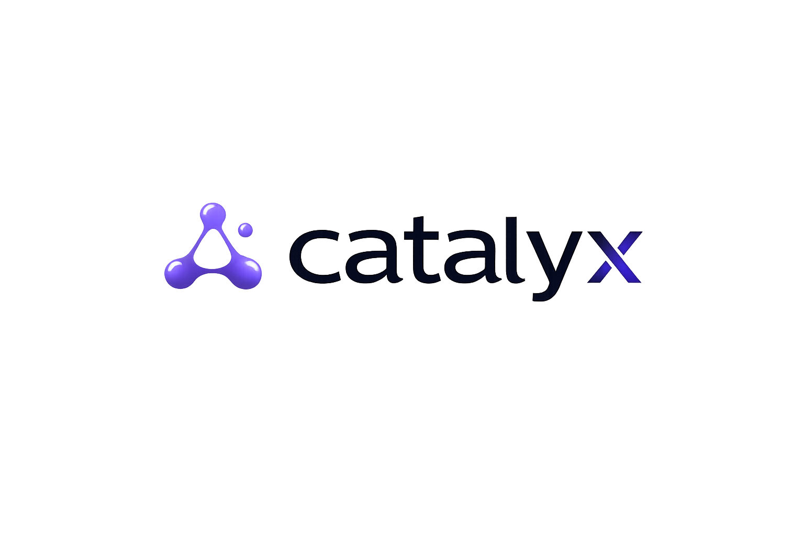

<p align="center">
  
</p>

<p align="center">
  <strong>Macro catalyst intelligence for conviction-based ETF investing</strong>
</p>

<p align="center">
  Detect catalysts early · Score sectors systematically · Measure if you were right for the right reasons
</p>

<p align="center">
  <a href="https://abetatos.github.io/Catalyx/"><strong>▶ Live dashboard — abetatos.github.io/Catalyx</strong></a><br/>
  <sub>Static DuckDB-WASM site reading the committed parquet lake in-browser (no backend)</sub>
</p>

---

## What CATALYX does

Most investment platforms track what happened. CATALYX tracks **whether your reasoning was correct**.

The core question it answers is not "did I make money?" but **"did I make money because the thesis was right, or because I got lucky?"** These are very different things, and only the first one compounds.

It works in four stages:

```
┌─────────────────────────────────────────────────────────────────────────────┐
│  1. DETECT         │  2. SCORE          │  3. THESIS         │  4. CLOSE    │
│                    │                    │                    │              │
│  Find macro        │  Map catalysts     │  Write a           │  Decompose   │
│  catalysts before  │  to granular       │  structured,       │  what drove  │
│  they are priced   │  sectors.          │  falsifiable       │  the return. │
│  in.               │  Rank by           │  bet with          │  Update      │
│                    │  composite score.  │  explicit exit     │  priors.     │
│  WebSearch +       │  Python formula    │  conditions.       │              │
│  Catalyst YAMLs    │  (no LLM drift)    │  Machine-readable  │  Feedback    │
│                    │                    │  JSON              │  loop        │
└─────────────────────────────────────────────────────────────────────────────┘
```

---

## The full pipeline

```
   MACRO SCAN
   ─────────────────────────────────────────────────────
   WebSearch for new events + structural indicator updates.
   Output: CatalystEvent JSON, StructuralCatalyst YAML update.
        │
        ▼
   SECTOR SCORING
   ─────────────────────────────────────────────────────
   For each sector: compute composite score from 5 dimensions.
   Python formula — no free-floating LLM numbers.

   composite = catalyst_alignment × 0.30
             + momentum           × 0.25
             + flow_confirmation  × 0.20
             + valuation_relative × 0.15
             + (100 − crowding)   × 0.10

   Output: SectorSnapshot (ranked list of sectors).
        │
        ▼
   THESIS FORMULATION
   ─────────────────────────────────────────────────────
   Only after heatmap confirms sector rank.
   Machine-readable JSON with: sector, ETF, catalyst, entry params,
   explicit assumptions (each testable), invalidation conditions,
   expected return, time horizon, conviction tier → position size.
   Output: Thesis JSON in data/theses/
        │
        ▼
   EXECUTION
   ─────────────────────────────────────────────────────
   Log trades. Track P&L gross and net of Spanish CGT.
   Monitor: assumption status · catalyst decay · invalidation triggers.
   Output: Trade log, tax snapshot (YTD brackets).
        │
        ▼
   ATTRIBUTION
   ─────────────────────────────────────────────────────
   At close: decompose the return into 4 components.
   - Catalyst alpha: return attributable to the specific catalyst
   - Sector beta: sector moved but not from this catalyst
   - Market beta: broad market move dragged the sector
   - Timing luck: residual / unexplained
   Output: ClosedThesis JSON with right_reason_score.
        │
        ▼
   FEEDBACK LOOP
   ─────────────────────────────────────────────────────
   ClosedThesis → prior hit rate per catalyst-sector pair.
   Next time a similar catalyst fires, priors inform conviction tier.
   Output: CatalystSectorPrior table (Phase 3).
```

---

## The catalyst model — two types, not one

The most important design decision: event catalysts and structural catalysts are fundamentally different signals and must never be conflated.

```
STRUCTURAL CATALYSTS                    EVENT CATALYSTS
────────────────────────────────        ───────────────────────────────────
Secular, multi-year themes              Discrete, timestamped announcements
Persistent while indicators hold        Decay exponentially (½-life: ~46 days)
Updated quarterly via semaphores        Detected via WebSearch / news
Tracked in YAML files                   Stored as CatalystEvent JSON

Examples:                               Examples:
  Central banks buying gold             → NATO Hague Summit: 5% GDP by 2035
  AI capex supercycle                   → LME copper mine disruptions Q2 2026
  NATO rearmament cycle                 → US AI chip export controls tightened
  Grid as energy transition bottleneck  → Hormuz closure (strength 94, priced in)
  Copper datacenter demand              → Goldman raises copper 12-month target

         These are the FLOOR                  These are the SPIKE
```

### How they interact

An event catalyst doesn't exist in isolation — it relates to the structural backdrop:

```
Event CONFIRMS structural        Event CONTRADICTS structural       Event INDEPENDENT
──────────────────────────       ────────────────────────────────   ──────────────────────────
Amplifies the structural         Dampens the structural             Additive formula

amplifier scales with            dampener scales with               structural × 0.45
event strength:                  event strength:                  + event        × 0.55
  strength 91 → +10.9%             strength 91 → −16.4%
  strength 20 → +2.4%              strength 20 → −3.6%
  strength 0  → no change          strength 0  → no change

Floor: structural baseline       Cap: never below 0                 No interaction
is always preserved.             Never negative.                    Pure addition.
```

Why this matters: a rumour (strength 10) and an official announcement (strength 91) confirming the same structural catalyst produce very different amplification. A flat +12% for both would be wrong.

### Structural catalyst intensity — how it's computed

LLMs produce unstable numbers. Structural catalyst intensity is **computed from observable
indicators on a continuous [0,100] scale**, never free-assigned and never bucketed:

```
Step 1: score each indicator to a continuous [0,100]
  - if it has enough history (≥ min_history_points): its empirical PERCENTILE within
    its own value_history (where does today sit vs its past?)
  - otherwise: a saturating threshold curve — weak→~50, strong→~80, asymptoting to 100
    far above strong (no hard 100/65/20 jumps)
  The 🟢/🟡/🔴 colour is now display-only, a label derived FROM the score (not the input).

Step 2: indicator_avg = mean of the continuous indicator scores
Step 3: trend_delta from recent history (rising adds, falling subtracts)
Step 4: intensity = round(clamp(indicator_avg + trend_delta, 10, 95), 1)
```

Indicator `value_history` lives in the parquet lake (`data/lake/indicators/`), externalized from
the YAMLs. `intensity_engine` reads it to compute the percentile; the YAML keeps only the latest
value. Run `/catalyx-update` after any indicator change — it recomputes intensity algorithmically.

---

## Sector scoring in detail

The heatmap ranks sectors by composite score. Every dimension has a fixed computation method — no LLM-assigned floats.

```
┌─────────────────────────────────────────────────────────────────────────┐
│  DIMENSION           WEIGHT  HOW IT'S COMPUTED                          │
├─────────────────────────────────────────────────────────────────────────┤
│  catalyst_alignment   30%    Formula: structural × event interaction    │
│                              (confirms / contradicts / independent)     │
├─────────────────────────────────────────────────────────────────────────┤
│  momentum             25%    Cross-sectional percentile rank            │
│                              across 17+ sectors (yfinance)              │
│                              raw = 1m×0.20 + 3m×0.45 + 6m×0.35         │
│                              Bottom sector = 0, top sector = 100        │
├─────────────────────────────────────────────────────────────────────────┤
│  flow_confirmation    20%    ETF shares_outstanding × NAV, week-over-   │
│                              week delta → normalized [0–100]            │
│                              Note: AUM conflates price with net flows   │
├─────────────────────────────────────────────────────────────────────────┤
│  valuation_relative   15%    Analyst model vs current price             │
│                              (manual input, quarterly update)           │
├─────────────────────────────────────────────────────────────────────────┤
│  crowding_risk        10%    INVERTED: high crowding → penalizes score  │
│                              Based on narrative_maturity enum + COT     │
└─────────────────────────────────────────────────────────────────────────┘
```

### Narrative maturity — categorical, not numeric

Crowding risk is assessed via a 5-level categorical scale. No free-float number:

```
ignored      → emerging      → mainstream    → crowded       → exhausted
    │               │               │               │               │
 Absent from    In specialist   Consensus      Widely held.    Fully priced.
 sell-side      research.       sell-side.     Retail ETF      Thesis in
 coverage.      Starting in     Named in ETF   inflows accel.  mainstream
 No ETF         generalist      descriptions.  Top-10 HF       press 12m+.
 flows yet.     media.          >$500M AUM     themes.         P/E at max.
                                in theme.
```

Example: AI semiconductors (2025–2026) → `crowded`. AI datacenter copper demand (2025-Q4) → `emerging`.

---

## Thesis structure

A thesis is not a trade idea. It is a falsifiable machine-readable claim:

```json
{
  "thesis_id":        "thesis_20260603_copper_miners_datacenter_alpha",
  "sector_id":        "copper_miners",
  "primary_etf":      "COPX.L",
  "catalyst":         "AI datacenter copper demand mispriced by market",
  "conviction_tier":  2,
  "position_pct":     0.06,

  "assumptions": [
    {
      "id": "asm_01",
      "text": "Hyperscaler capex exceeds $700B in 2026",
      "data_source": "AWS/Azure/GCP quarterly earnings",
      "falsification": "CapEx guidance cut >15% in any two major hyperscalers"
    }
  ],

  "invalidation_conditions": [
    "LME copper price falls below $11,000 for 10+ days",
    "Goldman/JPM revise copper 12m target below $12,000"
  ],

  "entry": { "price_limit": 90.0, "currency": "USD" },
  "time_horizon_weeks": 36,
  "expected_return_pct": 40
}
```

Every assumption has a **specific data source** and a **specific falsification condition**. Vague assumptions ("copper demand stays strong") are rejected at creation time.

### Conviction tiers → position sizing

```
Tier 1  │  Max 12%  │  Strong catalyst + fresh signal + crowding low + prior hit rate > 65%
Tier 2  │  Max  8%  │  Good catalyst + some momentum + acceptable crowding
Tier 3  │  Max  4%  │  Interesting but high uncertainty or no prior data
```

---

## Closing a thesis — attribution decomposition

At close, returns are not just recorded — they are decomposed:

```
Total return P&L
       │
       ├── catalyst_alpha      The portion driven by YOUR specific catalyst materializing
       │                       (e.g., copper mispricing corrected as datacenter demand proved)
       │
       ├── sector_beta         Sector moved, but not specifically from this catalyst
       │                       (e.g., metals broadly rallied on dollar weakness)
       │
       ├── market_beta         Broad market move that dragged the sector along
       │                       (e.g., S&P rally lifted all boats)
       │
       └── timing_luck         Residual — unexplained by the above three
                               (Entry/exit timing, idiosyncratic noise)
```

Then `right_reason_score` is **computed** (not estimated):

```
right_reason_score =
    (validated_assumptions / total_assumptions) × 0.40
  + (catalyst_materialized ? 0.35 : 0.0)
  + (alpha_from_catalyst   ? 0.25 : 0.0)

→ Score of 0.90 = you were right AND for the right reason.
→ Score of 0.35 = you made money, but not because the thesis was right.
```

Only a high `right_reason_score` + repeated hit rate on the same catalyst type builds a durable edge.

---

## How updates work — the monthly cycle

Every month, the pipeline runs in a fixed order. Each step provides data the next step requires.

```
STEP 0 — Macro context                    WebSearch first, BEFORE reading any file.
  │       What changed globally since      Project files reflect last month.
  │       last month? Flag deltas vs       WebSearch reflects today.
  │       stored YAML data (>10% = flag).  The delta is the finding.
  │
  ▼
STEP 1 — /catalyx-scan                    TWO passes:
  │       Detect new catalysts             Pass 1 (Discovery): market-led.
  │                                          No taxonomy loaded. Find themes
  │                                          that don't exist yet.
  │                                        Pass 2 (Classification): taxonomy-led.
  │                                          Map detected events to known sectors.
  │                                          New events above strength 55 → JSON.
  ▼
STEP 2 — /catalyx-update                  Refresh stale indicators.
  │       Recompute structural             For each structural catalyst:
  │       catalyst intensity               - Update indicator values from WebSearch
  │                                        - Recompute semaphore scores (🟢🟡🔴)
  │                                        - Run intensity_engine → new current_score
  │                                        - Flag if trend changed direction
  ▼
STEP 3 — /catalyx-sector-study            Bottom-up analysis per sector.
  │       Generates SectorStudy JSON       Run for: top-5 catalyst_alignment sectors
  │                                        + any new gap sectors from Step 1.
  │       REQUIRED before heatmap:         Each study = analyst narrative, demand
  │       heatmap reads demand_drivers,    drivers, cycle position, ETF selection
  │       analyst_narrative, cycle_pos     rationale, watch triggers.
  │       from these files.
  ▼
STEP 4 — /catalyx-dashboard               Catalyst-level view.
  │       Catalyst dashboard               Shows all active structural + event
  │                                        catalysts ranked by algorithmic_score
  │                                        (the computed intensity). user_rank is
  │                                        only a tie-breaker among near-equals —
  │                                        never a score multiplier.
  ▼
STEP 5 — /catalyx-heatmap                 Sector-level view.
  │       Sector heatmap                   Calls sector_scorer for each sector:
  │                                          uv run python -m catalyx.scorer.sector_scorer
  │                                        Enforces 7-day study freshness gate —
  │                                        sectors with stale/missing studies rank
  │                                        with penalty. Full composite score.
  ▼
STEP 6 — /catalyx-thesis review           For each open thesis:
  │       Review open theses              - WebSearch each assumption data source
  │                                       - Update assumption_status (holding/weakening/broken)
  │                                       - Flag broken invalidation conditions
  │                                       - Concrete recommendation: hold / exit / reduce
  ▼
STEP 7 — /catalyx-thesis draft            Only AFTER heatmap confirms sector rank.
  │       Draft new thesis                Full schema: sector, ETF, assumptions,
  │       (if opportunity identified)     entry params, falsification conditions.
  │                                       Portfolio correlation check before opening.
  ▼
STEP 12 — Taxonomy Gap Review             Review data/taxonomy_proposals/*.json
          Promote or reject gaps          from Step 1 Discovery pass.
                                          Promote → add to sector_taxonomy.yaml.
                                          Reject → archive with reason.
```

Why this order is mandatory: sector studies (Step 3) provide data that the heatmap (Step 5) reads. Running the heatmap before studies produces incorrect rankings. WebSearch (Step 0) runs before any file read because project files reflect last month — the delta between stored data and current reality is often the most important finding.

---

## Granularity — why it matters

Adjacent sectors are never collapsed. Each differentiation reflects a distinct supply chain, demand driver, and pricing mechanism:

```
METALS                    DEFENSE                   ENERGY
─────────────────         ───────────────────────   ─────────────────────────────
gold physical             EU prime contractors       oil majors
gold miners               US defense                 LNG / gas distribution
silver                    cybersecurity              nuclear operators
copper                    space                      uranium miners
uranium miners            drones                     grid infrastructure / utilities
lithium
rare earth elements

TECH / AI                 FINANCIALS
───────────────────────   ─────────────────────────
semiconductor design       banks (EU / US separately)
semiconductor equipment    insurance
foundries                  fintech
AI infrastructure          private equity
```

60+ sectors defined in [catalyx/config/sector_taxonomy.yaml](catalyx/config/sector_taxonomy.yaml), including futuristic watch-only sectors (quantum computing, nuclear fusion, brain-computer interfaces) that track `watch_triggers` — specific conditions that would make them investable.

Watch-only sectors appear in the heatmap with a **NOT YET INVESTABLE** banner. They cannot be thesis targets.

---

## Architecture — permanent hybrid model

This is not a migration path from Claude to Python. Both layers are permanent because they are good at different things:

```
Claude (interface + intelligence layer)   Python (deterministic backbone)
────────────────────────────────────────  ──────────────────────────────────────
Conversational thesis formulation         Scoring formulas (no session drift)
News analysis & catalyst detection        Market data fetching (yfinance)
Assumption critique and discussion        File + parquet-lake reads/writes
Monthly review orchestration              Tax computation (Spanish CGT brackets)
Qualitative judgment (sector narrative)   Attribution decomposition math
Narrative maturity classification         Event decay calculation
Output formatting for the user            ETF flow data (shares_out × NAV)
```

**Skills call Python.** Each slash command (`.claude/commands/*.md`) calls `uv run python -m catalyx.<module> <args>` via Bash, receives deterministic JSON, and uses that as data for reasoning. Claude never free-assigns numbers that a formula can compute.

```
User runs /catalyx-heatmap
     │
     ▼
Skill calls: uv run python -m catalyx.scorer.sector_scorer --all
     │        uv run python -m catalyx.scorer.momentum_engine
     │        uv run python -m catalyx.data.flow_data
     │
     ▼  (deterministic JSON output)
Claude reads scores → formats heatmap → adds qualitative analysis
```

---

## Python modules (callable from skills)

| Module | CLI invocation | What it computes |
|---|---|---|
| `catalyx.data.market_data` | `uv run python -m catalyx.data.market_data` | yfinance ETF prices → momentum snapshot |
| `catalyx.data.flow_data` | `uv run python -m catalyx.data.flow_data [--write]` | shares_outstanding × NAV → flow_confirmation [0–100] |
| `catalyx.scorer.intensity_engine` | `uv run python -m catalyx.scorer.intensity_engine --all [--write-back]` | Continuous indicator scores → structural catalyst intensity |
| `catalyx.scorer.catalyst_scorer` | `uv run python -m catalyx.scorer.catalyst_scorer <sector_id>` | confirms/contradicts/independent formula + decay → catalyst_alignment |
| `catalyx.scorer.momentum_engine` | `uv run python -m catalyx.scorer.momentum_engine` | Cross-sectional percentile rank → momentum_score |
| `catalyx.scorer.sector_scorer` | `uv run python -m catalyx.scorer.sector_scorer <sector_id> [--all]` | Full composite score (orchestrates all scorers) |
| `catalyx.execution.tax_engine` | `uv run python -m catalyx.execution.tax_engine --gain N [--ytd-prior N]` | Spanish CGT 2026 progressive brackets |
| `catalyx.execution.portfolio` | `uv run python -m catalyx.execution.portfolio build-all` | Model portfolios = (score_run × strategy) → lake `portfolio_holding` |
| `catalyx.execution.nav_engine` | `uv run python -m catalyx.execution.nav_engine model <strategy> --backtest-days 180` | Buy-and-hold NAV vs SPY (model + real) → "¿batimos mercado?" |
| `catalyx.execution.trade_logger` | `uv run python -m catalyx.execution.trade_logger log <portfolio_id>` | Real-money trades (thesis+run lineage) → net positions + P&L |
| `catalyx.attribution.thesis_scorer` | `uv run python -m catalyx.attribution.thesis_scorer <path.json>` | right_reason_score from ClosedThesis |
| `catalyx.store.lake` / `lake_query` | `uv run python -m catalyx.store.lake_query ranking` | Parquet lake (Tier 2 truth) + DuckDB read-path |
| `catalyx.store.snapshot_repo` | `uv run python -m catalyx.store.snapshot_repo record` | Score-run history over the lake (record / history / validate) |
| `catalyx.store.catalyst_repo` | `python -m catalyx.store.catalyst_repo summary` | File-backed reader/digest for CatalystEvent / TaxonomyGapProposal |

---

## Storage — two tiers, no database

```
Tier 1 (git, hand-edited)     JSON/YAML documents: catalysts, theses, sector studies,
                              structural catalysts, configs, schemas, reports. The skill
                              interface — the *_repo modules read these files directly.

Tier 2 (git, parquet lake)    Computed time-series: momentum/flow snapshots, score runs,
                              sector snapshots, rank events, indicator history, portfolios.
                              Append-only, partitioned, committed to git. Queried via DuckDB
                              (the same SQL runs in DuckDB-WASM in the browser dashboard).
```

There is **no SQLite / no SQLAlchemy** — it was removed once the parquet lake became the source
of truth. CATALYX runs permanently as a **skill on the Claude Code session** (its credits +
WebSearch); it does not host its own LLM, API, or relational DB.

The live dashboard reads the committed lake in-browser via DuckDB-WASM (no backend):
**https://abetatos.github.io/Catalyx/** (`site/` + `scripts/build_site.py`, deployed by Actions).

---

## Spanish CGT — tax model

All capital gains in EUR, regardless of holding period (no short/long distinction in Spain):

```
Gain bracket          Rate    On this tranche
────────────────────  ──────  ────────────────────────────────────────────
First €6,000          19%     €0 – €6,000
Next €44,000          21%     €6,001 – €50,000
Next €150,000         23%     €50,001 – €200,000
Above €200,000        27%     Everything above €200,000

Brackets are applied sequentially across all realized gains YTD.
Non-EUR ETF returns are converted at the execution-date exchange rate.
```

---

## Current state

### Active structural catalysts (5)

| ID | Theme | Intensity | User rank |
|---|---|---|---|
| `struct_cb_gold_accumulation` | Central bank dedollarization — systematic gold buying | 90 | 1 (×1.40) |
| `struct_nato_rearmament` | NATO multi-year rearmament cycle | 88 | 2 (×1.20) |
| `struct_ai_capex_supercycle` | AI infrastructure capex — hyperscaler build-out | 89 | 2 (×1.20) |
| `struct_energy_transition_grid` | Grid as binding constraint of energy transition | 82 | 3 (×1.00) |
| `struct_copper_datacenter_demand` | AI datacenter copper demand mispriced by market | 78 | 2 (×1.20) |

### Recent event catalysts (5)

| ID | Event | Strength | Status |
|---|---|---|---|
| `cat_20260603_nato_defense_gdp` | NATO 3.5% GDP floor by 2028 — confirmed | 91 | Active, confirms `struct_nato_rearmament` |
| `cat_20260603_nato_hague_5pct_gdp` | Hague Summit: 5% GDP target by 2035 | 82 | Active, confirms `struct_nato_rearmament` |
| `cat_20260603_copper_supply_deficit_2026` | Multi-mine disruptions — 600k-tonne deficit | 78 | Active, confirms `struct_copper_datacenter_demand` |
| `cat_20260601_us_ai_chip_export_controls` | BIS closes China subsidiary loophole | 62 | Active, independent |
| `cat_20260228_hormuz_closure` | Strait of Hormuz closure | 94 | Fully priced in (is_priced_in: 1.0) |

### Sector snapshots

| Sector | Composite score | Notes |
|---|---|---|
| `grid_infrastructure_utilities` | 74.5 | Thesis in draft |
| `copper_miners` | 70.9 | Thesis in draft, entry price needs recalibration |

### Open theses (2 drafts, not yet opened)

| Thesis | Sector | ETF | Tier | Size |
|---|---|---|---|---|
| `thesis_20260603_copper_miners_datacenter_alpha` | copper_miners | COPX.L | 2 | 6% |
| `thesis_20260603_grid_infrastructure_utilities_bindingconstraint` | grid_infrastructure_utilities | IQQH.DE | 2 | 4% |

---

## Roadmap

CATALYX stays a **skill on the Claude Code session — permanently.** It does not evolve into a
self-hosted LLM/API product: the intelligence is Claude Code (its credits + WebSearch), the
backbone is deterministic Python over a parquet lake. So there is no Typer-CLI-for-the-user, no
`anthropic`/`openai` client, no FastAPI, and no Postgres migration on the roadmap.

```
Now (permanent)        Skill-based pipeline. Claude Code as interface + intelligence.
                        Python: scoring, parquet lake, market fetching, tax, portfolios, NAV.
                        Live dashboard on GitHub Pages (DuckDB-WASM over the committed lake).

Future (Python only — no DB, no self-hosted LLM)
                        valuation_engine + return_decomposer (attribution).
                        ML feedback loop on closed theses (XGBoost / Bayesian priors;
                          catalyst novelty via local sentence-transformers embeddings).
                        Backtesting: GDELT / CFTC COT, walk-forward, strict no-look-ahead.
```

---

<p align="center">
  Built for investors who want to know if their edge is real.
</p>
